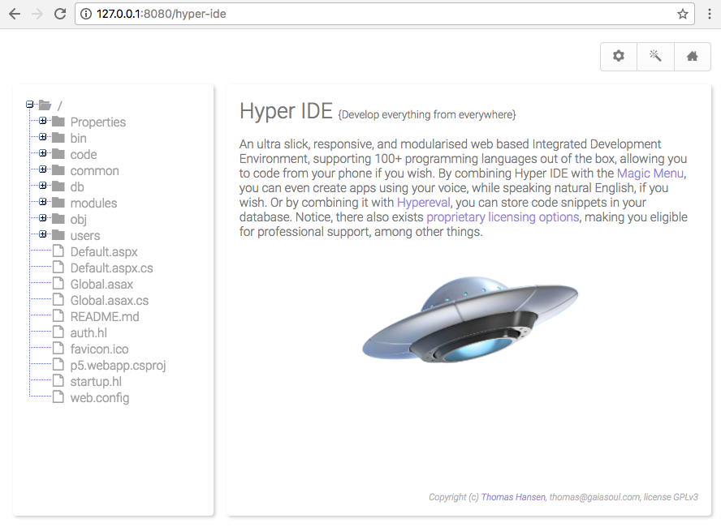
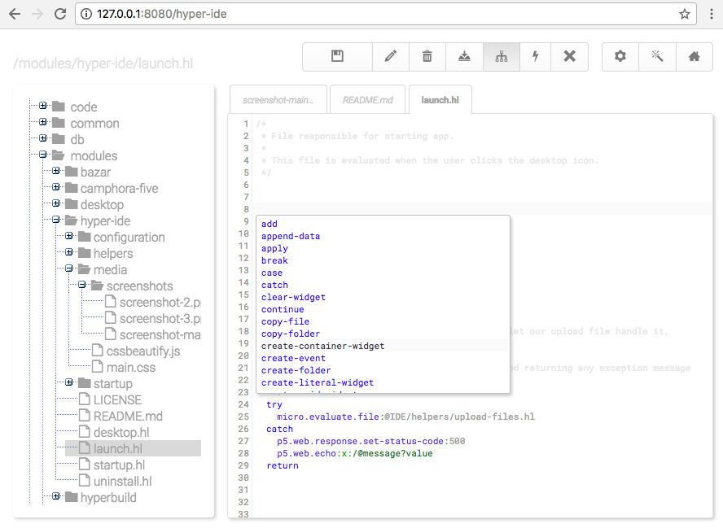

# Hyper IDE

Hyper IDE is a web based IDE (Integrated Development Environment) that supports more than 100 programming 
languages out of the box. You can use it on localhost, through e.g. Visual Studio, Mono Develop or Xamarin -
Or install it on a web server, having easily access to your code, from anywhere in the world.

## Features

* Autocomplete (uses any-word for languages besides XML, HTML, JavaScript, Hyperlambda, CSS)
* Minify JavaScript and CSS files
* Beautify CSS files
* Preview Markdown files
* Shell integration for things such as Git and other tasks
* Maximise code editor (fills entire browser window if you want it to, Alt+M)
* Browsing, editing, deleting and creating files and folders
* Downloading files to your local computer
* Uploading (multiple) files to your server
* More than 100 languages supported out of the box
* Multiple open files at the same time
* Intelligent indentation while editing
* Automatically closing brackets and parantheses for most languages
* Error feedback, when you have a syntax error is in your code
* Tracking of active item in _'solution explorer'_
* Plugin support

## Implementation/technology

Hyper IDE is built on top of CodeMirror and Phosphorus Five, and in its entirety created in JavaScript 
and Hyperlambda. It should work in all browsers, including most mobile browsers, allowing you to code 
from your iPhone if you wish. Hyper IDE is a web based IDE, so unless you intend to run it through Visual 
Studio, or something similar, through localhost - It probably performs best through some sort of web/intranet 
server. The underlaying technology is C#/ASP.NET/Mono and WebForms. However, being a Phosphorus Five module, 
these parts are barely visible, and completely abstracted away. The ViewState doesn't exist for one, and
the markup it renders is 100% HTML5 conforming.

## Performance

One of my primary reasons for creating Hyper IDE, was actually due to that Visual Studio on my Mac 
computer started becoming extremely sluggish and slow. Particularly for some operations, such as editing
CSS and JavaScript files. This became increasingly annoying for me, until I figured I'd 
simply *'port Visual Studio to the web'*, and create my own alternative for editing my code, 100% 
based upon JavaScript, HTML, CSS, and the web. The performance of Hyper IDE is hence surprisingly good, 
and in fact for most operations, it performs far better than Visual Studio - At least the Xamarin/Mac 
version I tend to mostly use.

It consumes tiny amounts of bandwidth, if you consider what it actually does. Opening
up Hyper IDE, and start editing a handful of code files, seldom downloads more than  ~0.5MB of data -
Of course depending upon how large your code files are. Below is a screenshot of how 
it can look with a different theme than the default theme, if you don't like my choice of colors.

## Installation

If you want to use it locally, you'll need some sort of .Net/Mono runtime, e.g. Visual Studio, Mono Develop,
or Xamarin (now Visual Studio for Mac), in addition to the following.

* [Phosphorus Five](https://github.com/polterguy/phosphorusfive)
* [Micro](https://github.com/polterguy/micro)

The easiest way to install Hyper IDE though, is to [install Phosphorus Five](https://github.com/polterguy/phosphorusfive/releases),
for then to afterwards simply visit _"The Bazar"_ and install it through the Bazar. If you want a more 
manual process, you'll need to unzip Hyper IDE's download into your _"modules"_ folder, which you can 
find inside of your main Phosphorus Five download folder's _"core/p5.webapp"_ folder. Hyper IDE is
a Phosphorus Five module, and will not work without Phosphorus Five. Makes sure your Hyper IDE's modules folder
is called exactly _"/hyper-ide/"_.

## Roadmap

* Backup of folders (downloading as ZIP files)
* Template support (choosing from a pre-defined set of templates when creating new files, according to file type)
* Even better plugin support, even though today's plugin support is actually fairly good

## Keyboard shortcuts

Hyper IDE features tons of keyboard shortcuts. The most useful ones are as follows.

* Alt+S - Saves active file
* Alt+X - Close active editor
* Alt+W - Open next code window (it's close to tab)
* Alt+Q - Open previous code window
* Cmd+F, Ctrl+F - Find (supports regex)
* Alt+F - Find (persistent)
* Cmd+Alt+F, Ctrl+Alt+F - Replace (supports _'replace all'_ and regex)
* Alt+M - Maximise code editor
* Alt+G - Go to line
* Tab - Indent selected code one additional tab level
* Shift+Tab - De-indent selected code one tab level
* Ctrl+Space - Shows autocompletion window

## License options

Hyper IDE is a part of the GaiaSoul suite, and hence licensed as GPL version 3, but a proprietary license,
with professional support can be obtained. Check out [our website for details](https://gaiasoul.com/license).
