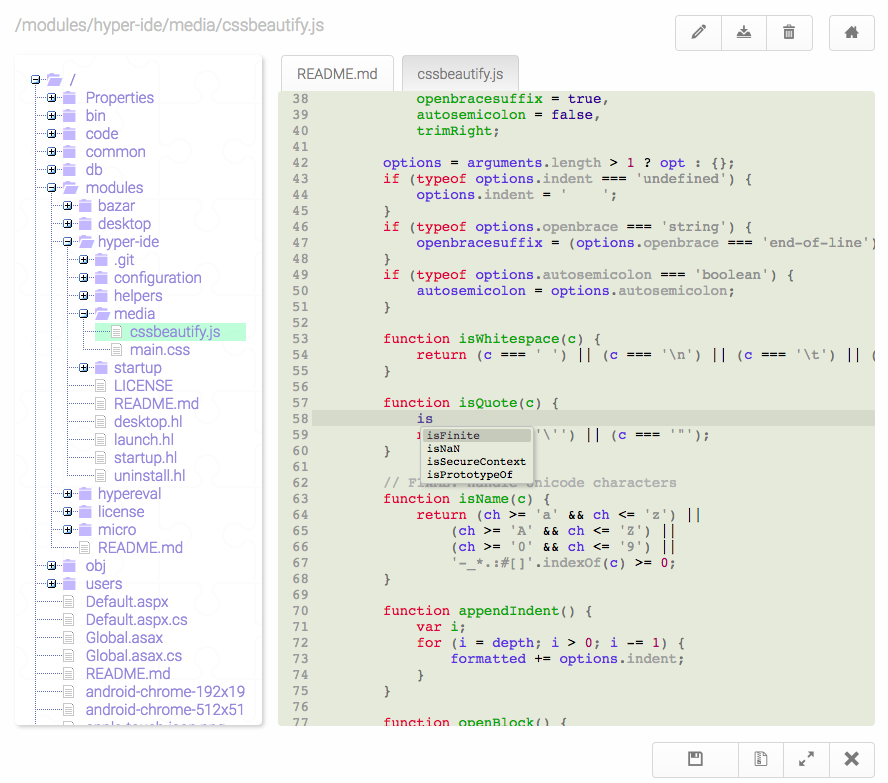
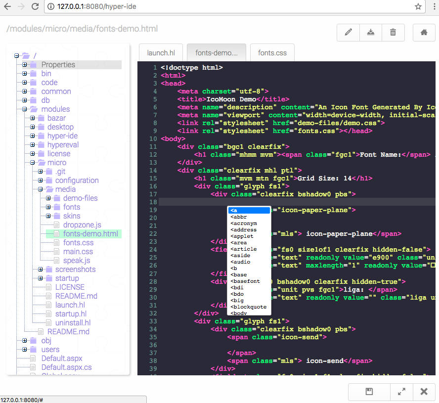
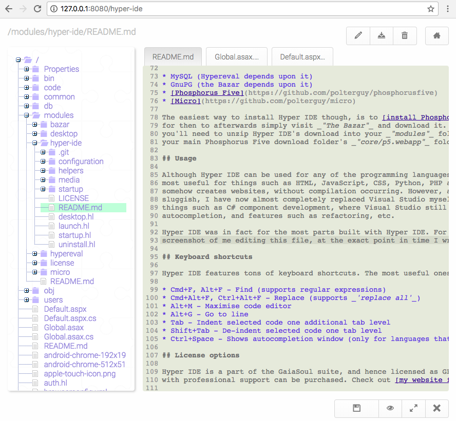

# Hyper IDE

Hyper IDE is a web based IDE (Integrated Development Environment) that supports more than 100 programming 
languages out of the box. It does not feature any project files or structure, and does not plan on ever 
getting one, but rather allows you to browse all your files, on your web server, and edit these as you 
see fit, and hence works with any projects types, as long as your project files are text files.

## Implementation/technology

Hyper IDE is built on top of CodeMirror and Phosphorus Five, and in its entirety created in Hyperlambda.
It should work in all browsers, including most mobile browsers, allowing you to code from your iPhone
if you wish. Hyper IDE is a web based IDE, so unless you intend to run it through Visual Studio, or 
something similar, through localhost, it probably performs best through some sort of web/intranet server.

## Performance

One of my primary reasons for creating Hyper IDE, was actually due to that Visual Studio on my Mac 
computer started becoming extremely sluggish and slow. Particularly for some operations, such as editing
CSS and JavaScript files. This became increasingly annoying for me, until I figured I'd 
simply *"port Visual Studio to the web"*, and create my own alternative for editing my code files, 100% 
based upon JavaScript, HTML, CSS and the web. The performance of Hyper IDE is hence surprisingly good, 
and in fact for most operations, it performs far better than Visual Studio - At least the Xamarin/Mac 
version I tend to mostly use.

It consumes ridiculously small amounts of bandwidth, if you consider what it actually does. Opening
up Hyper IDE, and start editing a handful of code files, seldom downloads more than  ~0.5MB of data
from my server. Of course depending upon how large your code files are. Notice though, if you have many
large code files open at the same time, performance starts dropping, and you will experience lag in your
HTTP requests. I suggest not having more than 5 files open at the same time. Below is a screenshot of
how it can look with a different theme than the one that is used by default out of the box.

## Features

In addition to autocomplete, syntax highlighting, error feedback and such. Hyper IDE also features a
rich plugin architecture, allowing you to easily create your own plugins (in Hyperlambda) if you wish.
In fact, the minifier that is natively distributed as an integral part of Hyper IDE, and the Markdown
previewer, are plugins, and not a part of the core IDE itself. Below is a non-exhautsive list of features.

* Minify JavaScript and CSS files
* Beautify CSS files (more beautifiers will come later)
* Preview Markdown files
* Maximise code editor (fills entire browser window if you want it to, Alt+M)
* Browsing and editing all your files on your server's htmldoc folder
* Downloading files to your local computer
* Deleting, creating, editing any text file, e.g. PHP, JavaScript, CSS, Python files, etc
* Creating new folders and modifying existing folders. Basically complete _'folder explorer'_ support
* More than 100 languages supported out of the box (Markdown, HTML, JavaScript, CSS, Python, XML, PHP, Ruby, Go, C#, Hyperlambda, etc)
* Multiple open files at the same time (in different tabs)
* Intelligent indentation while editing
* Automatically closing brackets
* Error feedback, when a syntax error is in your code
* Tracking of active item in _"file explorer"_ (think _"solution explorer"_ if you come from a Visual Studio background)

Some features which are high up on my TODO are as follows.

* Ability to execute shell scripts on server, to integrate things such as GIT, compilation, etc.
* More configuration options (today you'll have to choose theme through _'Hypereval'_ for instance)
* Uploading of files
* Backup of folders (downloading as ZIP files)
* Uploading of files (both binary and text-based files)
* Template support (choosing from a pre-defined set of templates when creating new files, according to file type)

However, in general, it is already a very feature rich IDE.

## Installation

If you want to use it locally, you'll need some sort of .Net/Mono runtime, e.g. Visual Studiom MonoDevelop,
or Xamarin (now Visual Studio for Mac), in addition to the following.

* MySQL (Hypereval depends upon it)
* GnuPG (the Bazar depends upon it)
* [Phosphorus Five](https://github.com/polterguy/phosphorusfive)
* [Micro](https://github.com/polterguy/micro)

The easiest way to install Hyper IDE though, is to [install Phosphorus Five](https://github.com/polterguy/phosphorusfive),
for then to afterwards simply visit _"The Bazar"_ and download it. If you want a more manual process,
you'll need to unzip Hyper IDE's download into your _"modules"_ folder, which you can find inside of
your main Phosphorus Five download folder's _"core/p5.webapp"_ folder.

## Usage

Although Hyper IDE can be used for any of the programming languages it supports, I suspect it will be
most useful for things such as HTML, JavaScript, CSS, Python, PHP and Hyperlambda - Languages which
somehow creates websites, without compilation occurring. However, as Visual Studio becomes increasingly
sluggish, I have now almost completely replaced Visual Studio myself with Hyper IDE, for anything besides 
things such as C# component development, where Visual Studio still is superior, due to superior 
autocompletion, and features such as refactoring, etc.

Hyper IDE was in fact for the most parts built with Hyper IDE. For instance, below you can see a 
screenshot of me editing this file, at the exact point in time I wrote the text.

## Keyboard shortcuts

Hyper IDE features tons of keyboard shortcuts. The most useful ones are as follows.

* Cmd+F, Alt+F - Find (supports regular expressions)
* Cmd+Alt+F, Ctrl+Alt+F - Replace (supports _'replace all'_)
* Alt+M - Maximise code editor
* Alt+G - Go to line
* Tab - Indent selected code one additional tab level
* Shift+Tab - De-indent selected code one tab level
* Ctrl+Space - Shows autocompletion window (only for languages that supports this, such as HTML, JavaScript, XML, CSS etc)

## License options

Hyper IDE is a part of the GaiaSoul suite, and hence licensed as GPL version 3, but a proprietary license,
with professional support can be purchased. Check out [my website for details](https://gaiasoul.com/license).

## Language support

Hyper IDE has autocomplete for many languages, including HTML, XML, JavaScript, Hyperlambda, and more.
It also features syntax highlightning for more than 100 different languages. It comes with 57 different 
themes out of the box, but you can easily apply your own favourite colors and skin for it, by editing 
a single CSS file, with some 25-35 different selectors. Hyper IDE supports the following programming 
languages, markup languages, and syntaxes, though only a handful of these have autocompletion at the time.

* APL
* ASN.1
* Asterix dialplan
* Brainfuck
* C, C++, C#
* Ceylon
* Clojure
* Closure Stylesheets (GSS)
* CMake
* COBOL
* CoffeeScript
* Common Lisp
* Crystal
* CSS
* Cypher
* Cytho
* D
* Dart
* Django
* Dockerfile
* diff
* DTD
* Dylan
* EBNF
* ECL
* Eiffel
* Elixir
* Elm
* Erlang
* Factor
* FCL
* Forth
* Fortran
* F#
* Gas (AT&T style assembly)
* Gherkin
* Go
* Groovy
* HAML
* Handlebars
* Haskell (Literate)
* Haxe
* HTML embedded (JSP, ASP.NET)
* HTML moxed-mode
* HTTP (requests and response)
* IDL
* Java
* JavaScript
* Jinja2
* Julia
* Kotlin
* LESS
* LiveScript
* Lua
* Markdown
* Mathematica
* mbox
* mIRC
* Modelica
* MscGen
* MUMPS
* Nginx
* NSIS
* N-Triples/N-Quads
* Objective C
* OCaml
* Octave
* Oz
* Pascal
* PEG.js
* Perl
* PGP (ASCII armor)
* PHP
* Pig Latin
* PowerShell
* Properties files
* ProtoBuf
* Pug
* Puppet
* Python
* Q
* R
* RPM
* reStructuredText
* Ruby
* Rust
* SAS
* Sass
* Spreadsheet (formula definition)
* Scala
* Scheme
* SCSS
* Shell
* Sieve
* Slim
* Smalltalk
* Smarty
* Solr
* Soy
* Stylus
* SQL (several different dialects)
* SPARQL
* Squirrel
* Swift
* sTeX, LaTeX
* Tcl
* Textile
* Tiddlywiki
* Wiki wiki
* TOML
* Tornado
* troff
* TTCN
* TTCN Configuration
* Turtle
* Twig
* VB.NET
* VBScript
* Verilog/SystemVerilog
* VHDL
* Vue.js
* Web IDL
* XML
* HTML
* XQuery
* Yacas
* Yaml
* Yaml (frontmatter)
* Z80
